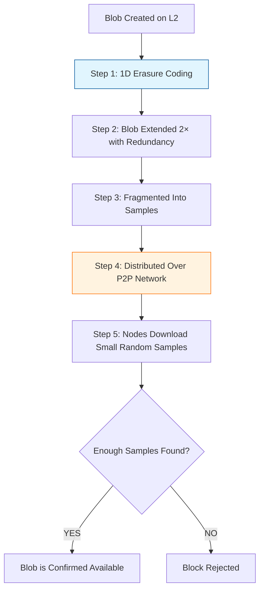
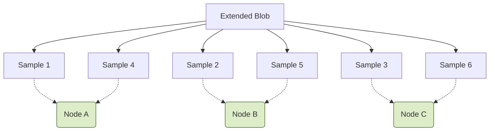

# PeerDAS Demo — Understanding Ethereum’s Next Big Scaling Upgrade (EIP-7594)

Welcome to the **PeerDAS Demo**!
This site explains how **EIP-7594 (Peer Data Availability Sampling)** revolutionizes Ethereum scalability by making data availability *massively* more efficient — without compromising decentralization or security.

This guide walks through:

* Why data availability is the bottleneck for rollups
* How earlier upgrades (EIP-4844) helped
* How **PeerDAS** completes the next step toward *full danksharding*
* How blobs, erasure coding, and sampling actually work

---

# 1. Why Ethereum Needs PeerDAS

Rollups rely on Ethereum to store their transaction data so users can reconstruct state if needed.

### ❗ The Core Problem

Traditionally, **every node downloads all the data** to ensure it’s available.
This isn’t scalable as Ethereum increases blob capacity.

### What happens if data availability fails?

| Rollup Type            | What Happens If Data Is Withheld?                                          |
| ---------------------- | -------------------------------------------------------------------------- |
| **Optimistic Rollups** | No one can generate a fraud proof → **funds can be stolen**                |
| **ZK Rollups**         | Proof is valid, but users can’t build Merkle proofs → **funds get frozen** |

### Before EIP-4844

Ethereum used calldata for L2 data → **expensive** and **limited capacity**.

### EIP-4844 (Proto-Danksharding)

Introduced **blobs** (cheap, separate data space).
Great improvement — but validators still must download **every blob** to verify it exists.

This limits scaling. To go from 3 blobs/block to 64+ blobs/block, we need something better.

---

# 2. Enter EIP-7594: PeerDAS

PeerDAS changes how nodes verify blob availability:

> **Instead of downloading entire blobs, nodes download tiny random _samples_.**
> If the network can collectively fetch enough samples, it’s mathematically guaranteed the full blob is available.

This is possible thanks to **erasure coding** — the heart of PeerDAS.

---

# ⚙️ 3. How PeerDAS Works (Step-by-Step)

Below is the lifecycle of a blob under PeerDAS:

---

## Step 1: 1D Erasure Coding (2× Extension)

Each blob (128 KB) is expanded to **256 KB**.

Why?

- With 2× erasure coding, **any 50% of the data can reconstruct the full blob**.
- Missing pieces don’t matter unless > half the blob disappears.

**Analogy:**
A 4-piece puzzle becomes an 8-piece puzzle — but **any 4 pieces** can still recreate the full picture.

---

## Step 2: Fragmentation

The extended blob is chopped into many tiny “samples.”

These samples are what nodes store and exchange.

---

## Step 3: P2P Distribution

Instead of broadcasting the full blob:

- Each peer only receives a small subset of the samples
- Which samples you store depends on your node ID / subnet

Nodes never see the whole blob — just **their assigned samples**.

---

## Step 4: Collective Verification (Sampling)

Every node downloads a few random samples.

If a malicious producer tries to hide data, they'd need to hide **over half** the samples.

The odds that thousands of nodes all “miss” the hidden samples is **astronomically low**.

Thus, if random sampling succeeds → the blob is available.

This unlocks **secure, scalable data availability**.

---

# 4. Summary: Why PeerDAS Matters

# 5. PeerDAS vs EIP-4844

| Feature             | EIP-4844 (Proto-Danksharding) | EIP-7594 (PeerDAS)          |
| ------------------- | ----------------------------- | --------------------------- |
| Data Type           | Blobs                         | Blobs                       |
| Validator Bandwidth | Must download full blobs      | Only tiny samples           |
| Bottleneck          | Node bandwidth                | Network sampling efficiency |
| Blob Count Limit    | ~3 per block                  | 64+ per block (future)      |
| Tradeoff            | Cheaper data                  | Massive scalability         |

---

# Conclusion

PeerDAS is one of the most important steps toward Ethereum’s future:

- Much cheaper L2 fees
- Much higher data throughput
- Same decentralization and security
- Foundation for _full danksharding_

This demo site shows how blobs, erasure coding, sampling, and networking all fit together to scale Ethereum for the next decade.

# Attribution

This demo draws inspiration and information from the following sources:

- [Lion DappLion's YouTube explainer](https://youtu.be/bONWd1x2TjQ)
- ["Unpacking EIP-7594: A Technical Deep Dive into PeerDAS and Ethereum’s Scalability Roadmap" by Krieger (Medium)](https://medium.com/@Krieger69/unpacking-eip-7594-a-technical-deep-dive-into-peerdas-and-ethereums-scalability-roadmap-28caf9dcaf16)
- [EIP-7594: Peer Data Availability Sampling (Official EIP)](https://eips.ethereum.org/EIPS/eip-7594)
